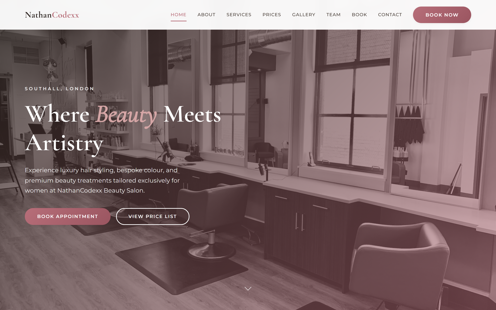
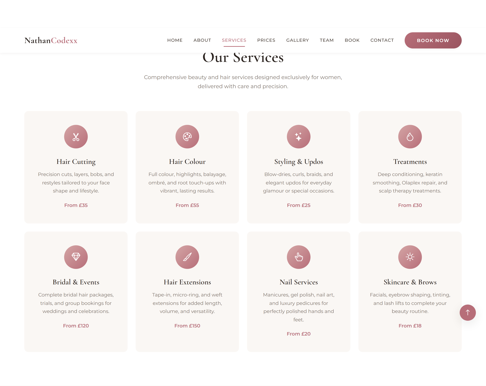
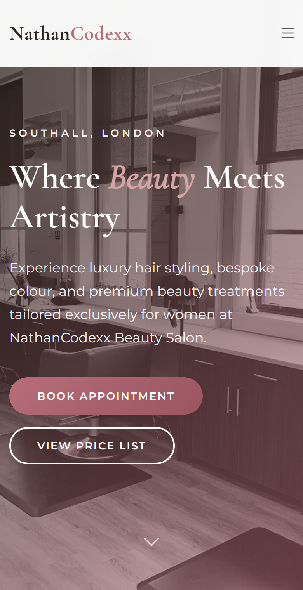
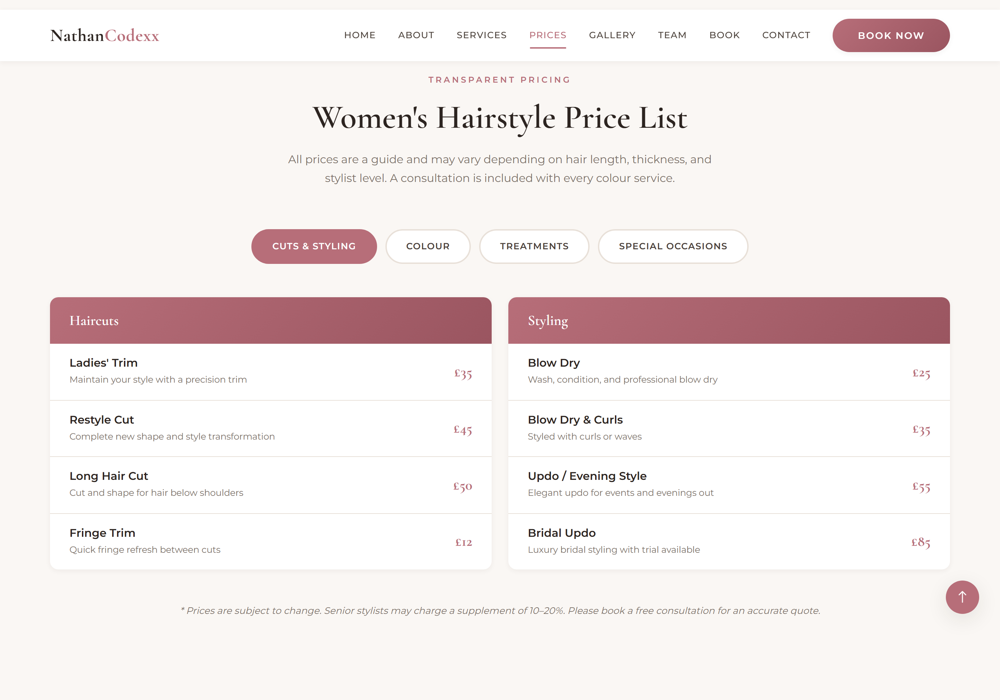
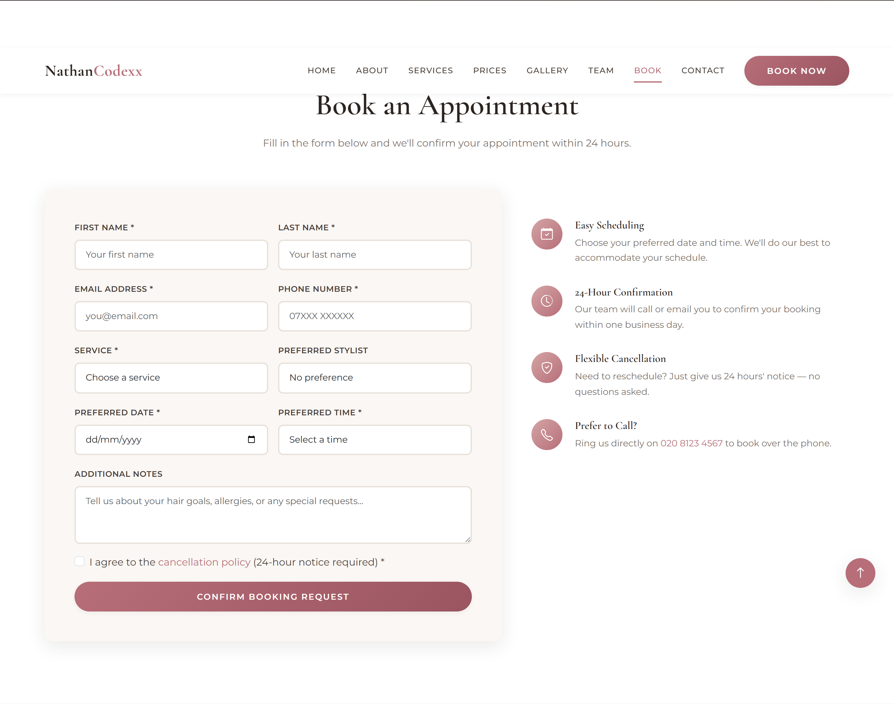

# NathanCodexx Beauty Salon

A sophisticated, responsive beauty salon website built with HTML5, CSS3, JavaScript, and Bootstrap 5.

**Location:** Southall, London



## Screenshots

| Desktop | Mobile |
|---------|--------|
|  |  |
|  | |
|  | |
|  | |

<details>
<summary>View full-page screenshots</summary>

**Desktop (full page)**


**Mobile (full page)**


</details>

## Features

- **Responsive design** — Mobile-first layout using Bootstrap 5 grid and components
- **Hero & about** — Brand introduction and salon story
- **Services overview** — Hair, nails, skincare, and bridal packages
- **Women's hairstyle price list** — Detailed pricing for cuts, colour, treatments, and styling
- **Style gallery** — Filterable image gallery with lightbox preview
- **Online booking form** — Client-side validation with service and stylist selection
- **Testimonials** — Client reviews carousel
- **Contact & map** — Address, phone, email, opening hours, and embedded map
- **Smooth navigation** — Sticky navbar with scroll-spy and back-to-top button

## Project Structure

```
webdesign-beauty-salon-business/
├── index.html          # Main single-page website
├── README.md           # Project documentation
├── css/
│   └── style.css       # Custom styles and theme
├── js/
│   └── main.js         # Interactivity, validation, gallery
├── screenshots/        # Website previews for GitHub
├── scripts/
│   └── capture-screenshots.py  # Regenerate screenshots
└── images/
    └── gallery/        # Gallery image assets (see note below)
```

## Getting Started

1. Clone or download this repository.
2. Open `index.html` in any modern web browser — no build step required.
3. For local development with live reload, use any static server, for example:

   ```bash
   npx serve .
   ```

   Or with Python:

   ```bash
   python -m http.server 8000
   ```

   Then visit `http://localhost:8000`.

## Regenerating Screenshots

To capture fresh screenshots after design changes:

```bash
pip install playwright
python -m playwright install chromium
python scripts/capture-screenshots.py
```

Output is saved to the `screenshots/` folder.

## Gallery Images

The gallery uses high-quality placeholder images from [Unsplash](https://unsplash.com). To use your own photos:

1. Add images to `images/gallery/`.
2. Update the `src` attributes in the gallery section of `index.html`.

Recommended size: **800×1000 px** (portrait) for consistent layout.

## Customisation

| Item | File | What to change |
|------|------|----------------|
| Salon name & tagline | `index.html` | Hero and footer sections |
| Prices | `index.html` | `#pricing` section tables |
| Opening hours | `index.html` | `#contact` section |
| Colours & fonts | `css/style.css` | CSS variables in `:root` |
| Form behaviour | `js/main.js` | `initBookingForm()` function |

## Booking Form

The booking form performs client-side validation and displays a success message. To connect it to a real backend:

1. Replace the submit handler in `js/main.js` with a `fetch()` call to your API.
2. Or integrate a service such as Calendly, Fresha, or Square Appointments.

## Browser Support

- Chrome (latest)
- Firefox (latest)
- Safari (latest)
- Edge (latest)

## Technologies

- HTML5
- CSS3 (custom properties, flexbox, grid)
- JavaScript (ES6+)
- [Bootstrap 5.3](https://getbootstrap.com/)
- [Bootstrap Icons](https://icons.getbootstrap.com/)
- [Google Fonts](https://fonts.google.com/) — Cormorant Garamond & Montserrat

## License

This project is provided for educational and portfolio use. Replace placeholder content and images before production deployment.

---

© 2026 NathanCodexx Beauty Salon — Southall, London
